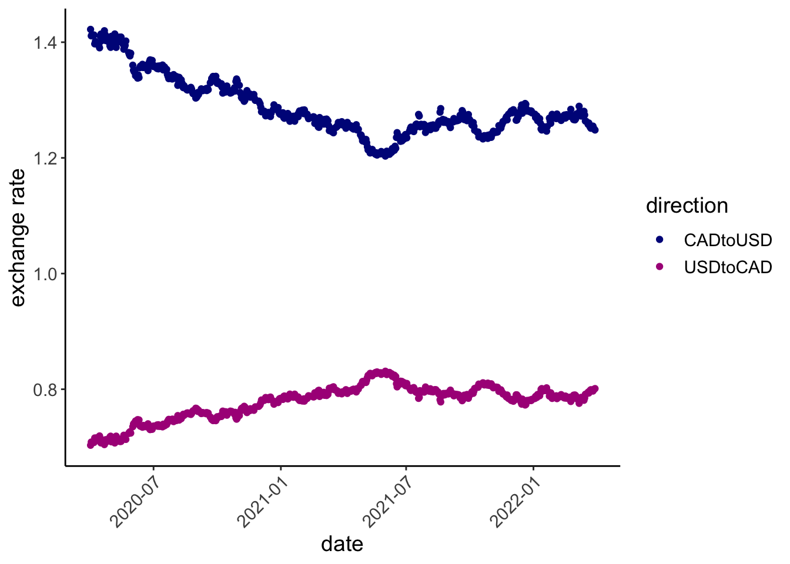
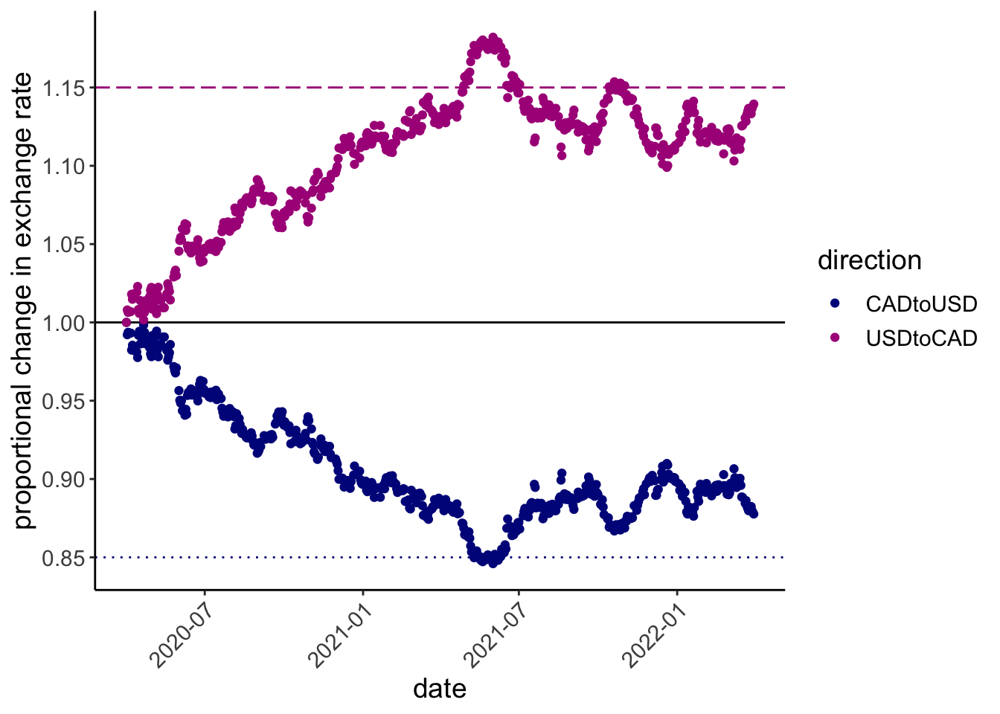
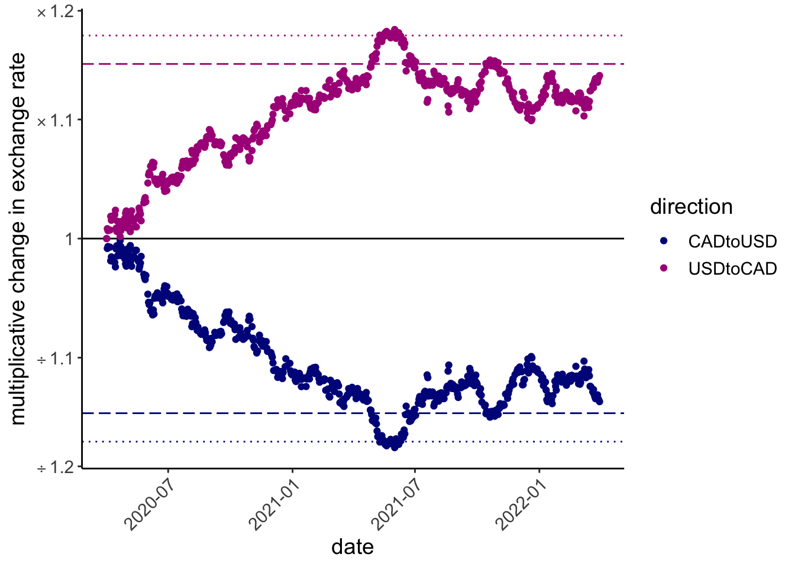

<!-- README.md is generated from README.Rmd. Please edit that file -->
<style>
.caption {
    color: #3399ff;     
    font-weight: bold;
        }
</style>

# ratioScales

<!-- badges: start -->

[](https://github.com/mikeroswell/ratioScales/actions/workflows/R-CMD-check.yaml)
[](https://CRAN.R-project.org/package=ratioScales)
<!-- badges: end -->

Logarithmic axis scales can clearly communicate multiplicative changes;
they can also confuse. **ratioScales** annotates logarithmic axis scales
with tickmarks that denote proportional and multiplicative change simply
and explicitly.

The main function in this package, `scale_*_ratio()`, is ggplot-friendly
and works similarly to existing`scale_*_*` functions from **ggplot2**
and **scales**.

## Installation

You can install the development version of ratioScales from
[GitHub](https://github.com/) with:

``` r
# install.packages("remotes")
remotes::install_github("mikeroswell/ratioScales")
```

## Example

Consider exchange rates between US and Canadian dollars:

``` r

exch %>% 
  ggplot(aes(date, exRate, color = direction)) + 
  geom_point() +
  scale_color_manual(values = hcl.colors(4, "Plasma")[c(1,2)]) +
  labs(y = "exchange rate") 
```

<div class="figure">


<p class="caption">
Exchange rates between US and Canada during the COVID-19 pandemic
</p>

</div>

Let’s see, relative to some baseline (1 April 2020), is the Canadian
dollar gaining or losing ground against the US dollar, and by how much?

``` r

 exch %>%  ggplot(aes(date, exRate_scale, color = direction)) + 
   geom_hline(yintercept = 1, color = "black")+
   geom_point() +
   scale_color_manual(values = hcl.colors(4, "Plasma")[c(1,2)]) +
   geom_hline(yintercept = 0.85
              , color = hcl.colors(4, "Plasma")[1], linetype = 3) +
   geom_hline(yintercept = 1.15
              , color = hcl.colors(4, "Plasma")[2], linetype = 5) +
  # FUNCTION FROM ggplot2
   scale_y_continuous(breaks = seq(80, 130, 5)/100) +
   labs(y = "proportional change in exchange rate") 
```

<div class="figure">


<p class="caption">
Proportional change in exchange rate from 1 April 2020 to 1 April 2022
</p>

</div>

But this is strange! Somehow the Canadian dollar *weakened* by **a
maximum of 15%** before rebounding, but the US dollar *strengthened* by
**much more than 15%**. Maybe not the best way to think about this?

**ratioScales** provides “rational” alternatives.

### divMult scale

The “divMult” scale in **ratioScales** shows absolute ratios, prefaced
by an operator sign (e.g., × or ÷), allowing easy and accurate
comparison of multiplicative changes.

``` r
exch %>%  ggplot(aes(date, exRate_scale, color = direction)) + 
   geom_hline(yintercept = 1, color = "black")+
  # times and divided by 1.15; longdash
   geom_hline(yintercept = 1/1.15
              , color = hcl.colors(4, "Plasma")[1]
              , linetype = 5) +
   geom_hline(yintercept = 1.15
              , color = hcl.colors(4, "Plasma")[2]
              , linetype = 5) +
  # times and divided by 0.85; dotted
   geom_hline(yintercept = 1/0.85
              , color = hcl.colors(4, "Plasma")[2]
              , linetype = 3) +
   geom_hline(yintercept = 0.85
              , color = hcl.colors(4, "Plasma")[1]
              , linetype = 3) +
   geom_point() +
   scale_color_manual(values = hcl.colors(4, "Plasma")[c(1,2)]) +
  # FUNCTION FROM ratioScales
   scale_y_ratio(tickVal = "divMult", n = 12, nmin = 12, slashStar = FALSE) +
   labs(y = "multiplicative change in exchange rate") 
```

<div class="figure">


<p class="caption">
exchange rate changes on the divMult scale
</p>

</div>

### percDiff

Prefer percentage differences? You can do this in a principled fashion
using `scale_y_ratio(tickVal = "percDiff")`.

``` r
exch %>%  ggplot(aes(date, exRate_scale, color = direction)) + 
   geom_hline(yintercept = 1, color = "black")+
  # times and divided by 1.15; longdash
   geom_hline(yintercept = 1/1.15
              , color = hcl.colors(4, "Plasma")[1]
              , linetype = 5) +
   geom_hline(yintercept = 1.15
              , color = hcl.colors(4, "Plasma")[2]
              , linetype = 5) +
  # times and divided by 0.85; dotted
   geom_hline(yintercept = 1/0.85
              , color = hcl.colors(4, "Plasma")[2]
              , linetype = 3) +
   geom_hline(yintercept = 0.85
              , color = hcl.colors(4, "Plasma")[1]
              , linetype = 3) +
   geom_point() +
   scale_color_manual(values = hcl.colors(4, "Plasma")[c(1,2)]) +
    # FUNCTION FROM ratioScales
   scale_y_ratio(tickVal = "percDiff") +
   labs(y = "percentage difference in exchange rate") 
```

<div class="figure">


<p class="caption">
caption explaining the reference lines
</p>

</div>

This preserves the true ratio-based differences on the visual plot, but
the values on the guide do not correspond simply to ratio differences
(and are not symmetric, see plot).

### centiNels

<metatext> We can also make a plot that will often be very similar to
the percDiff plot, but which uses numbers that are better for
quantitative analysis. </metatext>

<!-- some COMMENTS here to keep track of 
We think we are currently using GitHub Actions to re-render `README.Rmd` every time you push. An example workflow can be found here: <https://github.com/r-lib/actions/tree/v1/examples>.
&#10;When you add a new plot, don't forget to commit and push the resulting figure files, so they display on GitHub and CRAN.
&#10;Add alt-text (and consider adding short captions as well) to all figures
-->
